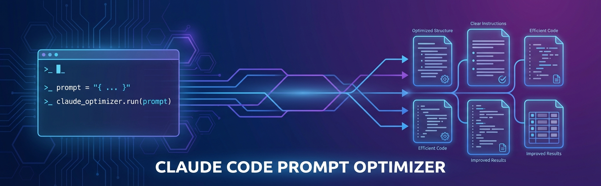

# Claude Code Prompt Optimizer



[](https://opensource.org/licenses/MIT)
[](https://nodejs.org)
[](https://www.anthropic.com)

A Claude Code hook that transforms simple prompts into detailed, structured instructions. Add `<optimize>` to any prompt and it'll expand your request into something Claude can really sink its teeth into.

## What It Does

When you tag a prompt with `<optimize>`, this hook intercepts it and runs it through Claude's extended thinking mode. The result is a fleshed-out version of your original request with:

- Specific implementation steps
- Error handling considerations
- Testing requirements
- Edge cases to watch for

Basically, it does the prompt engineering for you.

## Requirements

- Claude Code CLI installed
- Node.js 18+
- **One of the following:**
  - `CLAUDE_CODE_OAUTH_TOKEN` (Claude Pro/MAX subscribers)
  - `ANTHROPIC_API_KEY` (API credit users)
  - Stored OAuth from `claude login`

## Quick Install

```bash
git clone https://github.com/johnpsasser/claude-code-prompt-optimizer.git
cd claude-code-prompt-optimizer
npm run install-hook
```

The installer handles dependencies, auth setup, hook configuration, and verification.

## Authentication

The Agent SDK checks for credentials in this order:

| Priority | Method | Variable | Best For |
|----------|--------|----------|----------|
| 1 | OAuth token | `CLAUDE_CODE_OAUTH_TOKEN` | Claude Pro/MAX subscribers |
| 2 | API key | `ANTHROPIC_API_KEY` | API credit users |
| 3 | Stored OAuth | *(none — uses `claude login`)* | Already logged in |

If `CLAUDE_CODE_OAUTH_TOKEN` is set, the API key is ignored. If neither env var is set, the Agent SDK falls back to stored OAuth credentials from `claude login`.

### Setting Up OAuth Token

```bash
# Get your token
claude auth token

# Add to shell profile
export CLAUDE_CODE_OAUTH_TOKEN="your-oauth-token"
```

### Setting Up API Key

```bash
export ANTHROPIC_API_KEY="sk-ant-api03-..."
```

## Manual Setup

If you prefer to configure things yourself instead of using `npm run install-hook`:

### 1. Install Dependencies

```bash
git clone https://github.com/johnpsasser/claude-code-prompt-optimizer.git
cd claude-code-prompt-optimizer
npm install
```

### 2. Configure Auth

Set one of the environment variables above in your shell profile.

### 3. Configure the Hook

Add the hook to `~/.claude/settings.json`:

```json
{
  "hooks": {
    "UserPromptSubmit": [
      {
        "hooks": [
          {
            "type": "command",
            "command": "/path/to/claude-code-prompt-optimizer/src/hooks/optimize-prompt.sh"
          }
        ]
      }
    ]
  }
}
```

### 4. Make Hook Executable

```bash
chmod +x src/hooks/optimize-prompt.sh
```

Test it:

```
<optimize> write a function to calculate fibonacci numbers
```

For detailed setup instructions and troubleshooting, see [QUICKSTART.md](QUICKSTART.md).

## Examples

**Before:**
```
<optimize> create a REST API
```

**After:**
The optimizer expands this into specs covering architecture, endpoints, error handling, auth, validation, and testing.

**Before:**
```
<optimize> refactor this codebase for better performance
```

**After:**
You get a structured plan with profiling steps, bottleneck identification, prioritized refactoring targets, and benchmarking criteria.

## Configuration

| Variable | Description | Default |
|----------|-------------|---------|
| `CLAUDE_CODE_OAUTH_TOKEN` | OAuth token for Claude Pro/MAX (optional if logged in) | - |
| `ANTHROPIC_API_KEY` | Anthropic API key (used if no OAuth token) | - |
| `DEBUG` | Enable debug logging | `false` |

Debug logs go to `/tmp/claude-code-hook-debug.log`.

## Project Structure

```
claude-code-prompt-optimizer/
├── src/hooks/
│   ├── optimize-prompt.ts    # Core optimization logic (Agent SDK)
│   └── optimize-prompt.sh    # Shell wrapper
├── scripts/
│   └── install.js            # Automated installer
├── examples/                  # Usage examples
├── docs/                      # Additional documentation
└── QUICKSTART.md             # Installation guide
```

## How It Works

1. Hook watches for `<optimize>` in your input
2. Sends your prompt to Claude via the Agent SDK with a custom system prompt
3. Returns the expanded prompt back to Claude Code

The optimizer uses the Claude Agent SDK (`@anthropic-ai/claude-agent-sdk`) which handles authentication automatically — OAuth tokens, API keys, and stored credentials all work seamlessly.

## Troubleshooting

**Hook not triggering:**
- Check your settings.json path
- Run `chmod +x src/hooks/optimize-prompt.sh`
- Enable debug mode and check the logs

**Auth errors:**
- Check that `CLAUDE_CODE_OAUTH_TOKEN` or `ANTHROPIC_API_KEY` is exported
- If using stored OAuth, verify `claude login` works
- Run with `DEBUG=true` to see which auth method is active

**Missing deps:**
- Run `npm install`
- Check Node version is 18+

## Development

```bash
# Run directly
npx tsx src/hooks/optimize-prompt.ts < examples/test-input.json

# Run with debug output
DEBUG=true bash src/hooks/optimize-prompt.sh < examples/test-input.json

# Automated install
npm run install-hook
```

## Contributing

PRs welcome. Fork it, make a branch, add tests, submit.

## License

MIT. See [LICENSE](LICENSE).
